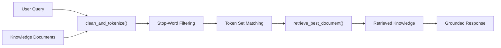

# 📚 Smart Librarian: Minimalist RAG System from Scratch

[](https://www.python.org/)
[](LICENSE)
[](#)

A pure Python, dependency-free implementation of a **Retrieval-Augmented Generation (RAG)** pipeline. This project demonstrates how text retrieval, semantic document ranking, and context injection work under the hood without relying on external heavy frameworks.

---

## 🌟 Overview

Before modern LLM frameworks like LangChain or LlamaIndex, the fundamental problem of information retrieval was built on tokenization, stopword removal, and vocabulary overlap. **Smart Librarian** breaks down this retrieval architecture into clear, readable stages, demonstrating how an AI assistant selects the most relevant knowledge snippet before formulating a response.

---

## 🚀 Version Evolution

The project is structured into three iterations demonstrating progressive software engineering and NLP concepts:

| Version | Focus | Key Concepts |
| :--- | :--- | :--- |
| **`rag_v1.py`** | **Foundation** | String sanitization, tokenization, vocabulary sets, set intersections, context grounding prompt. |
| **`rag_v2.py`** | **Routing Engine** | Conditional ranking logic, threshold evaluation, and automated fallbacks when no relevant document is found. |
| **`rag_v3.py`** | **Modular Pipeline** | Custom stop-word filtering, modular tokenization function, scoring loop across document objects, and an interactive CLI shell. |

---

## 🧠 How It Works (Pipeline Architecture)



1. **Text Normalization & Tokenization**: Removes punctuation, normalizes text case, and splits sentences into discrete lexical tokens.
2. **Stop-Word Removal**: Discards noise words (`"is"`, `"the"`, `"and"`, etc.) to focus matching exclusively on high-information keywords.
3. **Similarity Scoring**: Computes the set intersection between the query tokens and each document's token dictionary.
4. **Context Retrieval**: Ranks candidate documents by score and retrieves the top-scoring knowledge document.

---

## 💻 Quickstart & Usage

No external libraries or pip installations required!

```bash
# Clone the repository
git clone https://github.com/inoy-252/smart-librarian-rag.git
cd smart-librarian-rag

# Run the interactive RAG system (v3)
python rag_v3.py
```

### 💡 Example Interactive Session:

```text
Ask the Smart Librarian a question (or type 'quit' to exit): Who plays chess?

==================================================
 MATCH FOUND! Topic: Chess (Score: 2)
==================================================
[RETRIEVED KNOWLEDGE]:
Chess is a game of tactics and strategies. This is a game played by two players at a time and the goal is to corner the other player's king and that is called checkmate. Some famous chess players are: Magnus Carlsen, Gary Kasparov, Hikaru Nakamura
==================================================

Ask the Smart Librarian a question (or type 'quit' to exit): quit

Goodbye! Have a great day.
```

---

## 📂 File Structure

```text
smart-librarian-rag/
├── rag_v1.py      # Basic set-intersection retrieval
├── rag_v2.py      # Conditional routing and topic determination
├── rag_v3.py      # Full modular CLI pipeline with stopword filtering
├── .gitignore     # Standard Python ignore rules
└── README.md      # Documentation
```

---

## 🔮 Roadmap / Future Enhancements

- [ ] Add TF-IDF (Term Frequency-Inverse Document Frequency) scoring.
- [ ] Implement cosine similarity using NumPy vector embeddings.
- [ ] Connect with an LLM API (such as Gemini or OpenAI) to generate synthesized prose answers grounded in retrieved knowledge.

---

## 👤 Author

**Yasir Lone ([@inoy-252](https://github.com/inoy-252))**
