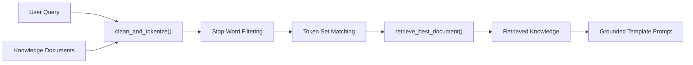
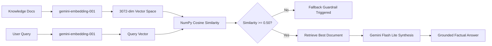

# Smart Librarian: Minimalist RAG System from Scratch

[](https://www.python.org/)
[](LICENSE)
[](#)

A pure Python, dependency-free implementation of a **Retrieval-Augmented Generation (RAG)** pipeline. This project demonstrates how text retrieval, semantic document ranking, and context injection work under the hood without relying on external heavy frameworks.

---

## Overview

Before modern LLM frameworks like LangChain or LlamaIndex, the fundamental problem of information retrieval was built on tokenization, stopword removal, and vocabulary overlap. **Smart Librarian** breaks down this retrieval architecture into clear, readable stages, demonstrating how an AI assistant selects the most relevant knowledge snippet before formulating a response.

---

## Version Evolution

The project is structured into progressive iterations demonstrating software engineering and NLP concepts from first principles to modern generative AI:

| Version | Focus | Key Concepts |
| :--- | :--- | :--- |
| **`rag_v1.py`** | **Foundation** | String sanitization, tokenization, vocabulary sets, set intersections, context grounding prompt. |
| **`rag_v2.py`** | **Routing Engine** | Conditional ranking logic, threshold evaluation, and automated fallbacks when no relevant document is found. |
| **`rag_v3.py`** | **Modular Pipeline** | Custom stop-word filtering, modular tokenization function, scoring loop across document objects, and an interactive CLI shell. |
| **`rag_v4.py`** | **Production Semantic RAG** | Dense 3,072-dim embeddings (`gemini-embedding-001`), NumPy cosine vector similarity, dynamic similarity guardrails, and grounded LLM answer synthesis (`gemini-3.5-flash-lite` / `gemini-3.8-flash`). |

---

## How It Works (Pipeline Architecture)

### 1. Lexical / Keyword Pipeline (`v1` - `v3`)

```mermaid
flowchart LR
    A["User Query"] --> B["clean_and_tokenize()"]
    B --> C["Stop-Word Filtering"]
    C --> D["Token Set Matching"]
    E["Knowledge Documents"] --> B
    D --> F["retrieve_best_document()"]
    F --> G["Retrieved Knowledge"]
    G --> H["Grounded Template Prompt"]
```

### 2. Dense Semantic Vector RAG Pipeline (`v4`)

```mermaid
flowchart LR
    A["Knowledge Docs"] --> B["gemini-embedding-001"]
    B --> C["3072-dim Vector Space"]
    D["User Query"] --> E["gemini-embedding-001"]
    E --> F["Query Vector"]
    C & F --> G["NumPy Cosine Similarity"]
    G --> H{"Similarity >= 0.50?"}
    H -- "No" --> I["Fallback Guardrail Triggered"]
    H -- "Yes" --> J["Retrieve Best Document"]
    J --> K["Gemini Flash Lite Synthesis"]
    K --> L["Grounded Factual Answer"]
```

---

## Quickstart & Usage

### Option A: Zero-Dependency Interactive CLI (`v3`)
No external libraries or pip installations required!

```bash
# Clone the repository
git clone https://github.com/inoy-252/smart-librarian-rag.git
cd smart-librarian-rag

# Run the interactive lexical RAG system (v3)
python rag_v3.py
```

### Option B: Production Semantic RAG with Gemini Embeddings & LLM (`v4`)

```bash
# Create and activate virtual environment
python -m venv rag_env
source rag_env/bin/activate  # On Windows: rag_env\Scripts\activate

# Install dependencies
pip install -r requirements.txt

# Add your Gemini API key in a .env file
echo "GEMINI_API_KEY=your_gemini_api_key_here" > .env

# Run the dense semantic RAG pipeline
python rag_v4.py
```

### Example Interactive Session (`v4`):

```text
============================================================
INDEXING: Generating semantic vectors for knowledge documents...
   Indexed: [PUBG] into 3072-dimensional vector.
   Indexed: [Chess] into 3072-dimensional vector.
   Indexed: [Football] into 3072-dimensional vector.
All documents indexed into vector space!
============================================================

Smart Librarian RAG v4 is ready! Ask anything about the library.
Type 'quit' to exit.

 Ask a question: Which game uses rifles and shrinking danger zones

--- Vector Similarity Breakdown ---
  Topic: PUBG       | Similarity Score: 0.6305
  Topic: Chess      | Similarity Score: 0.5430
  Topic: Football   | Similarity Score: 0.4894
----------------------------------

RETRIEVED TOPIC: [PUBG] (Confidence: 0.6305)
 Synthesizing grounded answer with Gemini 3.5 Flash Lite...

============================================================
SMART LIBRARIAN ANSWER:
The game is PUBG. According to the context, PUBG is an action-based
online game where players eliminate each other using loot supplies
like guns (including rifles), and features danger zones known as the
bluezone and redzone where players are eliminated without supplies.
============================================================
Source Citation: Smart Librarian Knowledge Base -> [PUBG]
```

---

## File Structure

```text
smart-librarian-rag/
├── rag_v1.py          # Basic set-intersection retrieval
├── rag_v2.py          # Conditional routing and topic determination
├── rag_v3.py          # Full modular CLI pipeline with stopword filtering
├── rag_v4.py          # Dense semantic embeddings + Cosine similarity + Gemini LLM synthesis
├── requirements.txt   # Dependencies (numpy, google-genai, python-dotenv)
├── .gitignore         # Ignores .env and virtual environments
└── README.md          # Comprehensive documentation
```

---

## Roadmap / Future Enhancements

- [x] Implement cosine similarity using NumPy vector embeddings.
- [x] Connect with an LLM API (Gemini) to generate synthesized prose answers grounded in retrieved knowledge.
- [ ] Add Hybrid Search (BM25 keyword search + dense semantic vectors with Reciprocal Rank Fusion).
- [ ] Add Cross-Encoder Re-ranking layer for enterprise multi-document ranking.

---

## Author

**Yasir Lone ([@inoy-252](https://github.com/inoy-252))**
